# 02 — Artifact Collection

## Example Case

This public example uses sanitized indicators.

| Artifact | Example |
|---|---|
| Display Name | Account Security |
| Sender | security-alert@example-mail[.]test |
| Recipient | analyst-lab@example[.]test |
| Subject | Action Required: Verify Your Account |
| Date | 2026-08-09 10:14 UTC |
| Originating IP | 192.0.2.44 |
| URL | hxxps://account-review[.]example/login |
| Root Domain | account-review[.]example |
| Attachment | None |

## Manual Collection Procedure

### 1. Record visible email information

Capture the sender, recipient, subject, date, visible message content, hyperlink text, and attachment names.

### 2. Review the raw email or `.eml`

Open the message source in an appropriate text editor or email-analysis tool. Search for fields such as:

```text
From:
To:
Subject:
Date:
Return-Path:
Reply-To:
Received:
Message-ID:
```

### 3. Identify the originating infrastructure

Review the `Received` chain and any platform-specific originating IP field. Do not automatically assume the first visible IP is attacker-controlled; identify which server actually introduced the message into the mail flow.

### 4. Extract URLs safely

Prefer copying the hyperlink destination through message-source inspection or an analysis platform. Do not browse the suspicious URL directly.

For public documentation, defang it:

```text
https://evil.example/login
```

becomes:

```text
hxxps://evil[.]example/login
```

### 5. Hash attachments without executing them

On Windows PowerShell:

```powershell
Get-FileHash .\suspicious-file.pdf -Algorithm SHA256
Get-FileHash .\suspicious-file.pdf -Algorithm SHA1
Get-FileHash .\suspicious-file.pdf -Algorithm MD5
```

Record the filename, file size, and hashes.

## Evidence to Save

Save screenshots according to `screenshot-guide.md`. Do not save or publish the real malicious attachment in a public repository.

---

## Hands-On Manual Artifact Collection

The following section documents the manual collection of artifacts from email samples. Raw `.eml` content was reviewed to identify message metadata, sending infrastructure, URLs, domains, attachments, and file hashes.

### Email 1 — Header and Message Artifacts

#### Sender Address

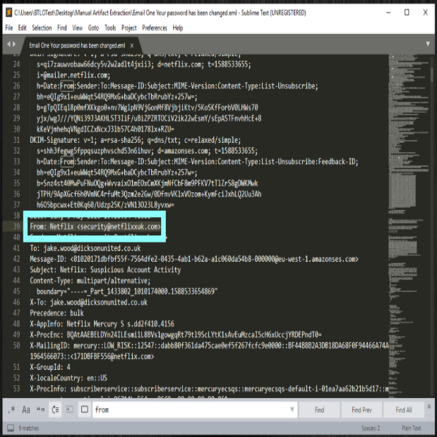

The raw `.eml` file was opened in a text editor and the `From` field was located to identify the sender.

**Observed sender:** `security@netflixxuk.com`

The sender address was recorded as an email artifact for further investigation. The domain resembles the Netflix brand but should not be considered legitimate based on appearance alone. Additional infrastructure and URL analysis is required before reaching a final determination.

#### Recipient Address

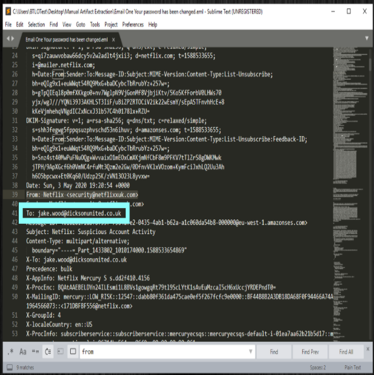

The raw `.eml` file was reviewed and the `To` field was located to identify the intended recipient.

**Observed recipient:** `jake.wood@dicksonunited.co.uk`

The recipient address was recorded as part of the message metadata. Identifying the intended recipient helps establish who was targeted by the message and provides context for determining the scope of the phishing investigation.

#### Subject

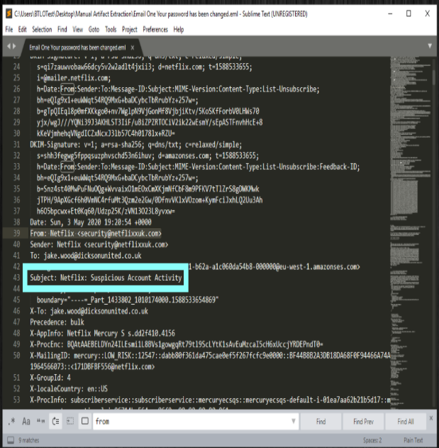

The raw `.eml` file was reviewed and the `Subject` field was located to identify the message subject.

**Observed subject:** `Netflix: Suspicious Account Activity`

The subject attempts to create concern by warning the recipient about suspicious activity involving a Netflix account. Security-related subject lines can be used to create urgency and encourage the recipient to interact with the message. This indicator should be evaluated together with the sender, URLs, sending infrastructure, and other email artifacts before reaching a final determination.


#### Date and Time

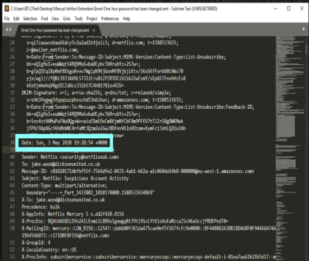

The raw `.eml` file was reviewed and the `Date` field was located to identify when the message was sent.

**Observed date/time:** `Sun, 3 May 2020 19:20:54 +0100`

The timestamp was recorded as part of the email metadata. Recording the message date and time helps establish the investigation timeline and can be correlated with other email, authentication, network, or endpoint activity.


#### Sender IP

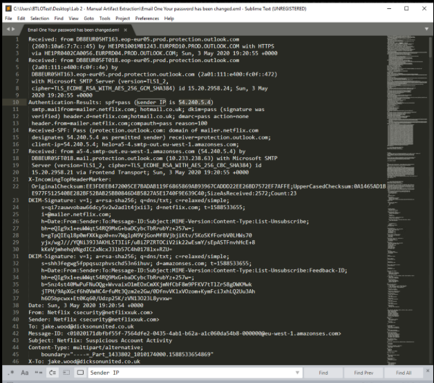

The raw `.eml` file was reviewed to identify the IP address associated with the message's sending infrastructure.

**Observed sender IP:** `54.240.5.4`

The sender IP was recorded as an infrastructure artifact for further investigation. An IP address can be used for additional enrichment, including WHOIS/RDAP ownership checks, reverse DNS lookups, reputation analysis, and correlation with other security telemetry. The IP should not be considered malicious based on the email header alone.


#### Reverse DNS Lookup

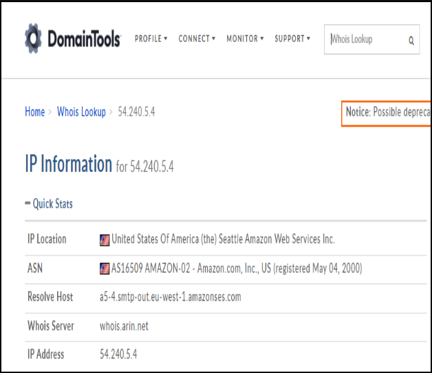

A reverse DNS lookup was performed on the identified sender IP address `54.240.5.4` to determine whether a hostname was associated with the sending infrastructure.

**Observed IP:** `54.240.5.4`

**Reverse DNS result:** `a5-4[.]smtp-out.eu-west-1[.]amazonses[.]com`

The reverse DNS result was recorded as an infrastructure artifact. This information can help identify the network or service associated with the sending IP and provide additional context during the investigation. A reverse DNS result alone does not establish whether the message is legitimate or malicious.


#### URL Extraction

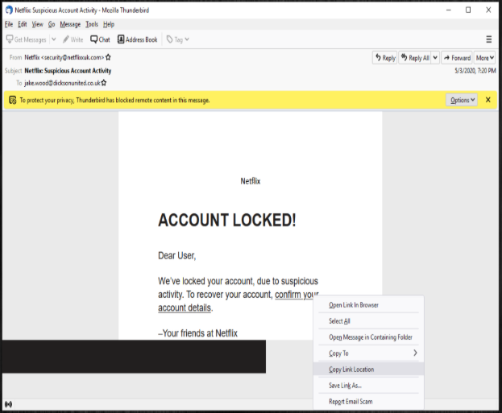

The email was reviewed to identify the destination of the embedded hyperlink. The URL was extracted without directly navigating to the destination, reducing the risk of interacting with potentially malicious content.

**Observed URL (defanged):**

`hxxps://www[.]thiswouldbeamalicioussite[.]com/index/2020/j411/NetflixLogin[.]php`

The URL was recorded as an investigation artifact for further analysis. The path contains `NetflixLogin.php`, which is consistent with a page designed to imitate a Netflix login workflow. This observation should be correlated with the sender information, domain analysis, and other indicators before reaching a final verdict.

For safe documentation, the URL has been defanged by replacing `https` with `hxxps` and periods in the domain with `[.]`.


#### Root Domain Identification

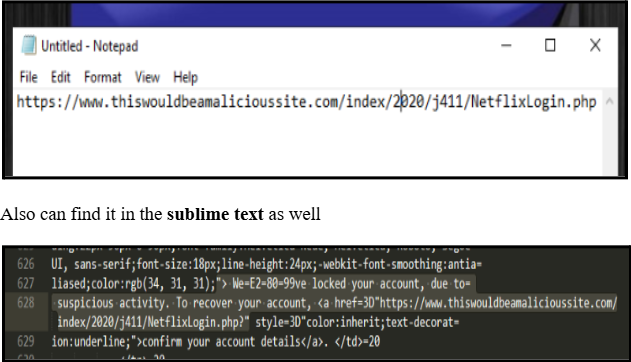

After extracting the URL from the email, the URL structure was reviewed to identify the root domain.

**Observed URL (defanged):**  
`hxxps://www[.]thiswouldbeamalicioussite[.]com/index/2020/j411/NetflixLogin[.]php`

**Root domain:** `thiswouldbeamalicioussite[.]com`

The root domain was separated from the remaining URL path so it could be used as an individual investigation artifact. Identifying the root domain allows the analyst to perform additional enrichment such as WHOIS/RDAP, DNS, reputation, and threat-intelligence checks without relying only on the complete URL.

The domain has been defanged in this documentation to prevent accidental navigation.


### Email 2 — Header, Message, and Attachment Artifacts

#### Sender Address

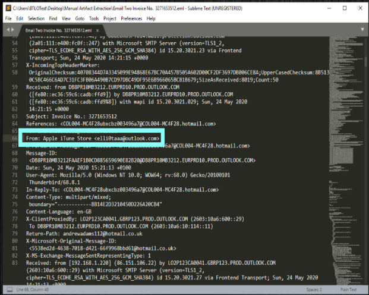

The raw `.eml` file was opened in Sublime Text and the `From` field was located using the Find feature (`Ctrl + F`) to identify the sender's email address.

**Observed sender:** `elli0taaa@outlook.com`

The sender address was recorded as part of the email metadata for further investigation. Identifying the sender provides an artifact that can be correlated with the sending IP address, email headers, message content, and attachment information.

At this stage, the sender address alone does not establish whether the message is malicious. Additional analysis of the email infrastructure and attachment is required.


#### Recipient Address

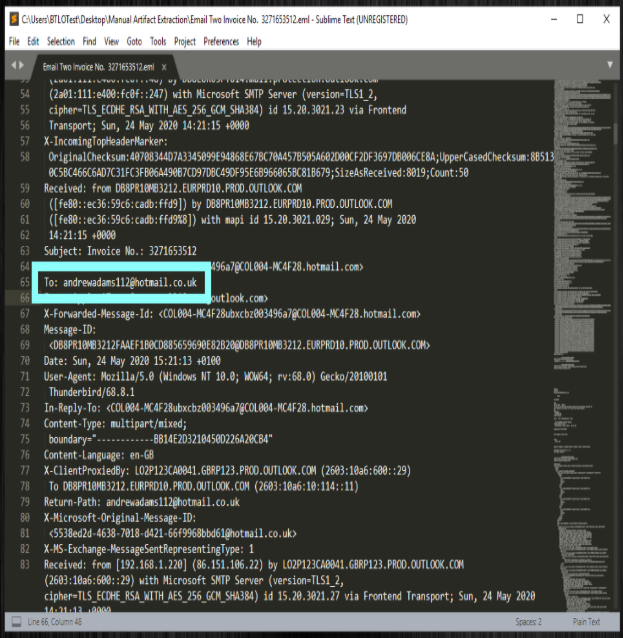

The raw `.eml` file was reviewed in Sublime Text and the `To` field was located to identify the intended recipient of the message.

**Observed recipient:** `andrewadams112@hotmail.co.uk`

The recipient address was recorded as part of the email metadata. Identifying the intended recipient helps establish who was targeted by the message and provides context for determining the scope of the investigation.

In a production SOC environment, this artifact could also be used to search for related messages, determine whether additional users received the same email, and assess the potential impact of the campaign.


#### Subject Line

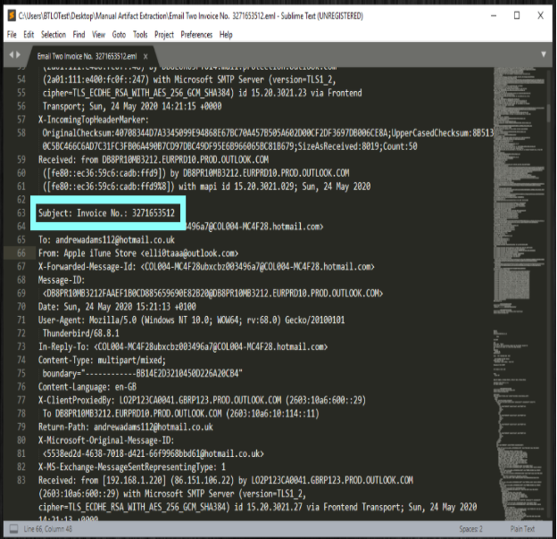

The raw `.eml` file was reviewed in Sublime Text and the `Subject` field was located to identify the subject line of the message.

**Observed subject:** `Invoice No.: 3271653512`

The subject line presents the message as an invoice and includes a specific invoice number. This information was recorded as an email artifact because subject lines can provide useful context about the sender's pretext and can also be used when searching for related messages during an investigation.

The subject alone does not establish malicious intent and should be correlated with the sender, recipient, sending infrastructure, message content, and attachment analysis.


#### Date and Time

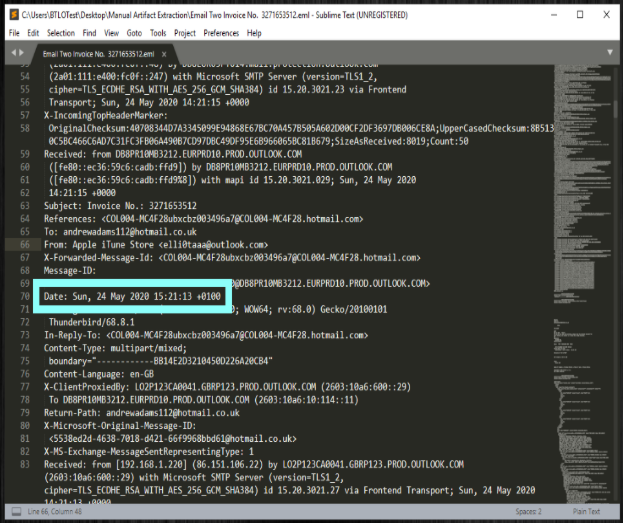

The raw `.eml` file was reviewed in Sublime Text and the `Date` field was located to determine the date and time associated with the message.

**Observed header value:** `Sun, 24 May 2020 15:21:13 +0100`

**Recorded date/time:** `24 May 2020 15:21:13`

The timestamp was recorded as part of the email metadata. Preserving the original time-zone offset (`+0100`) is useful during an investigation because timestamps may need to be normalized and correlated with other email, authentication, network, or endpoint events.

This artifact helps establish the message timeline and can support correlation with other activity associated with the email.


#### Sending Server IP Address

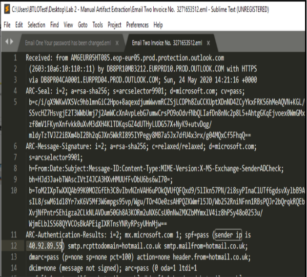

The raw `.eml` file was reviewed in Sublime Text to identify the IP address associated with the email's sending infrastructure. The relevant header information was located in the `Authentication-Results` section, where the `sender IP` value was recorded.

**Observed sender IP:** `40.92.89.55`

The IP address was collected as an infrastructure artifact for further investigation. Sender IP information can be enriched using WHOIS/RDAP, reverse DNS, reputation services, and threat-intelligence sources to better understand the infrastructure involved in delivering the message.

The IP address should not be considered malicious based solely on its presence in the email headers. It must be correlated with the complete mail-routing information and other collected indicators before reaching a final determination.

#### Reverse DNS / Hostname Lookup

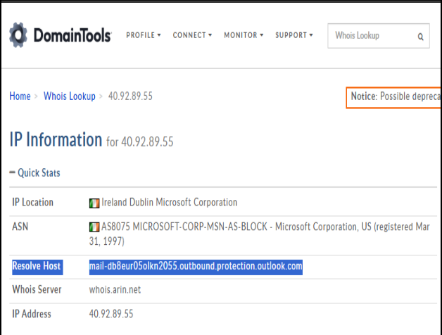

The sender IP address identified during the previous step was investigated using DomainTools to gather additional information about the sending infrastructure.

**Investigated IP:** `40.92.89.55`

**Resolved hostname:** `mail-db8eur05olkn2055.outbound.protection.outlook.com`

The lookup shows that the IP resolves to a hostname under `outbound.protection.outlook.com`. The result was recorded as an infrastructure artifact and can be correlated with the email's `Received` headers, sender information, and other collected indicators.

The lookup also associates the IP address with Microsoft Corporation and ASN `AS8075`. This information provides additional context about the infrastructure but does not, by itself, determine whether the email is malicious.


#### Attachment Filename

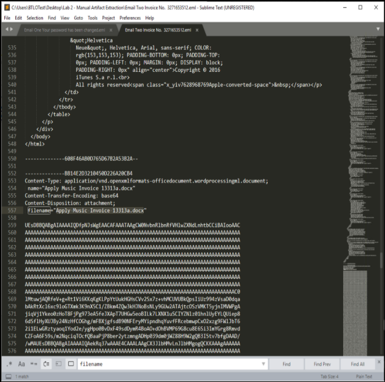

The raw `.eml` file was reviewed in Sublime Text and the `filename` field was located within the MIME attachment section to identify the full name and extension of the attached file.

**Observed filename:** `Apple Music Invoice 13313a.docx`

The MIME headers identify the attachment as a Microsoft Word document with the `.docx` extension. The filename was recorded as an attachment artifact for further investigation.

Because attachments in suspicious emails may contain malicious content, the file should not be opened or executed during initial analysis. Instead, it should be handled in a controlled environment and analyzed using its metadata, cryptographic hashes, and appropriate malware-analysis tools.


#### Attachment Verification in Thunderbird

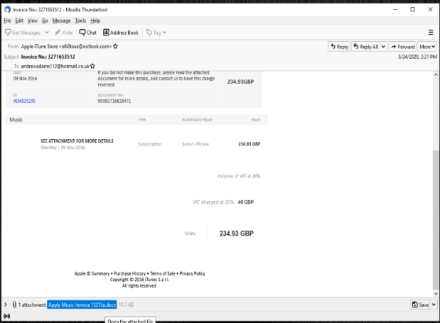

The attachment filename was also verified directly through the Mozilla Thunderbird email client. Thunderbird displays attachment information at the bottom of the opened message, providing an additional method of confirming the file associated with the email.

**Verified attachment:** `Apple Music Invoice 13313a.docx`

The filename displayed in Thunderbird matches the filename identified earlier in the raw `.eml` content. Confirming the artifact through both the MIME data and the email client helps validate that the correct attachment was identified before proceeding with file-hash collection and further analysis.

The attachment was not opened or executed during this verification step.

#### Attachment File Hashes

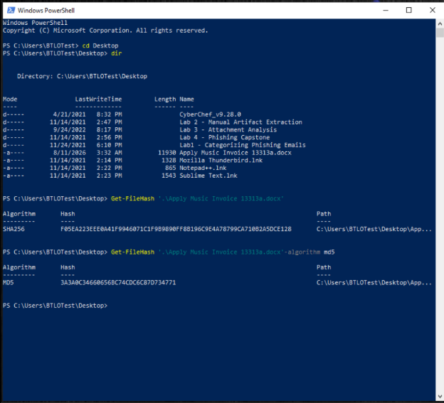

The attachment was saved to the analysis system and hashed using the PowerShell `Get-FileHash` cmdlet. Cryptographic hashes were collected without opening or executing the document.

**Attachment:** `Apple Music Invoice 13313a.docx`

**MD5:** `3A3A0C34660656BC74CDC6C87D734771`

**SHA256:** `F05EA223EE0041F9346971C1F98989FF8819C5CE4A78709CA71882A5FCE128`

PowerShell was used to calculate both hashes. Because SHA256 is the default algorithm used by `Get-FileHash`, it can be calculated without explicitly specifying an algorithm. MD5 was calculated by specifying `-Algorithm MD5`.

The hashes provide stable identifiers for the attachment and can be used for file verification, threat-intelligence searches, reputation checks, and correlation with other security telemetry.

Hash values alone do not establish whether a file is malicious. They should be correlated with reputation services, static or sandbox analysis, and other evidence collected during the investigation.
