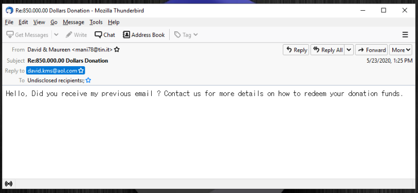
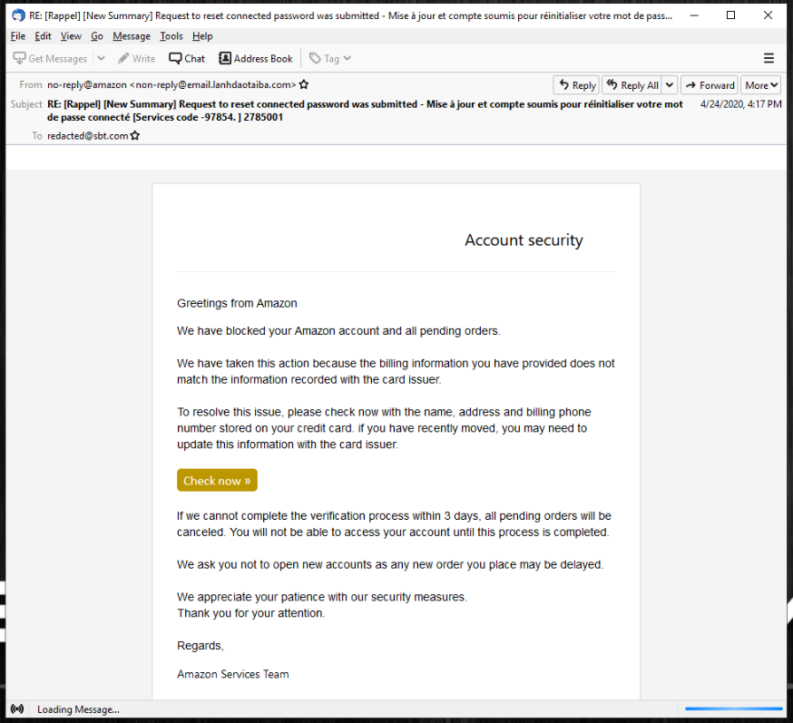
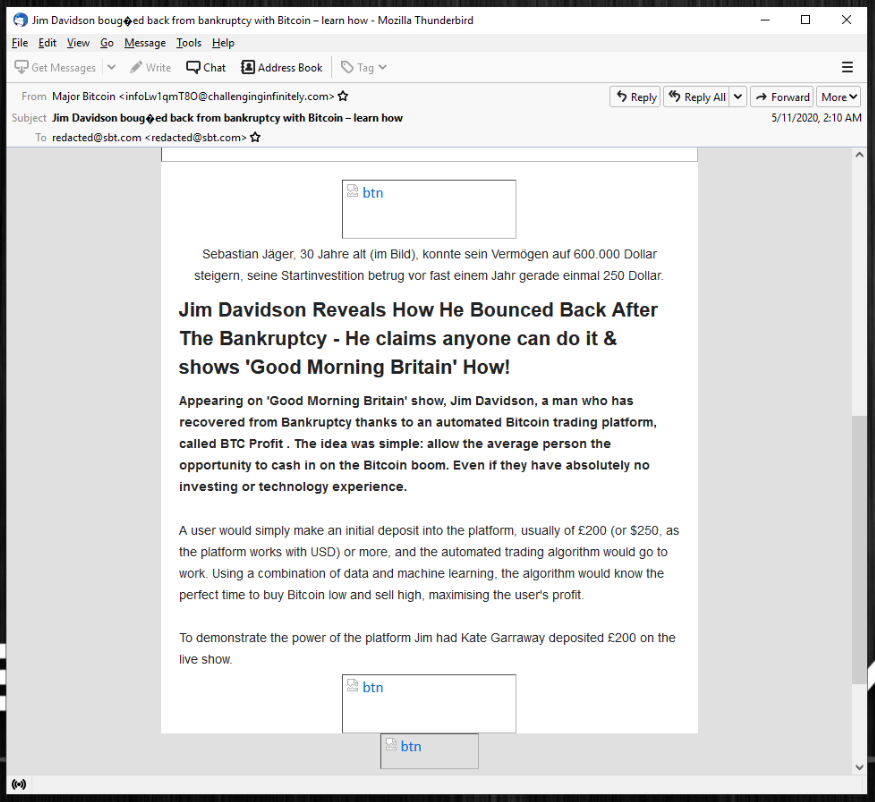

# Demo: Phishing Email Analysis

## Purpose

This section demonstrates a practical SOC workflow for examining a suspicious email, extracting artifacts, investigating URLs/domains and attachments, documenting evidence, and recommending defensive actions.

> **Safety:** Perform analysis in an isolated lab or analysis VM. Do not click suspicious links or execute attachments on a production system. Prefer passive-analysis and reputation services. Be careful when uploading email content or files to third-party services because they may contain confidential information.

## Software for Opening and Reviewing Email

A raw email (`.eml`) can be reviewed as text with tools such as:

- Visual Studio Code
- Notepad++
- Sublime Text
- A text editor available inside the analysis VM

For this portfolio, **Visual Studio Code** is a practical choice because it supports search, syntax highlighting, extensions, and Python development.

## Step 1 — Open the Suspicious Email Safely

Open the email in an isolated environment such as Kali Linux running in VMware. Review the raw email source rather than interacting with the message normally.

If a suspicious PDF or other attachment must be inspected, keep the analysis environment isolated and avoid opening active content unless the lab is specifically designed for malware analysis.

## Step 2 — Identify and Collect Artifacts

Use the editor search function to locate useful header fields and indicators. Collect items such as:

- Sender / `From`
- Recipient / `To`
- Subject
- Date and time
- `Return-Path`
- `Reply-To`
- `Received` headers
- Sending/originating IP address
- Message-ID
- URLs and domains
- Attachment names and file types
- Authentication results such as SPF, DKIM, and DMARC when available

Record the artifacts in the project worksheet and IOC file before beginning reputation checks.

## Step 3 — Investigate the Sending IP and Domain

Use WHOIS/RDAP and passive infrastructure sources to gather context about the sending IP or domain. Useful information can include:

- Registered organization or network owner
- ASN / hosting provider
- Registration dates for domains, when available
- Nameservers
- Resolved IP addresses
- Geographic/network registration information

Treat WHOIS location as registration/network information rather than proof of the attacker's physical location.

## Step 4 — Investigate the URL

Do **not** directly browse a suspicious URL from the normal workstation. Use passive or controlled analysis services instead.

### VirusTotal

Submit or search the sanitized URL/domain to review detections and reputation information. Record relevant findings such as detection verdicts, categories, first/last analysis dates, and related indicators.

### URL2PNG or Similar Screenshot Service

A remote webpage screenshot service can help show how a page looked without directly browsing it from the analyst workstation. If the page is no longer available, document that limitation.

### WannaBrowser or Similar Remote Browser

A remote browser or web-analysis service may provide page, request, redirect, or response information without requiring direct interaction from the production endpoint.

### Hybrid Analysis

Where appropriate, use a sandbox/reputation service to check whether an indicator or submitted sample has malicious behavior or community detections. If a MITRE ATT&CK mapping is provided, treat it as supporting evidence and validate it against observed behavior.

### URLhaus

Search URLhaus for known malicious URL records, status, tags, payload associations, and reporter information when available.

## Step 5 — Use PhishTool for Email Triage

PhishTool or a similar email-analysis platform can automate extraction of headers, URLs, domains, and other indicators from an email.

Useful areas to review may include:

- Header and sender information
- Extracted URLs
- WHOIS/domain information
- Web capture results
- HTTP requests and response headers
- Reputation or enrichment results

Automated results should support the analyst's investigation, not replace manual validation.

## Step 6 — Analyze Attachments with Hashes

Before uploading or opening an attachment, calculate cryptographic hashes. In PowerShell:

```powershell
Get-FileHash '.\<file_name>'
Get-FileHash -Algorithm MD5 '.\<file_name>'
Get-FileHash -Algorithm SHA1 '.\<file_name>'
```

`Get-FileHash` uses SHA-256 by default. Record the SHA-256 hash as the primary file indicator; MD5 and SHA-1 can be included for compatibility with older threat-intelligence records.

A hash can then be searched in approved reputation sources without executing the file. Do not upload confidential attachments to public services unless organizational policy permits it.

## Step 7 — Inspect Hyperlinks Without Clicking

When reviewing the message in a safe viewer, hovering over a hyperlink may reveal its actual destination. Where supported, use **Copy hyperlink** / **Copy link address** instead of clicking it.

Compare the displayed link text with the actual destination. A mismatch can be a phishing indicator, although it is not sufficient by itself to prove maliciousness.

## Step 8 — Correlate the Evidence

A malicious URL may exist on an otherwise legitimate or currently clean root domain. This can occur when a legitimate website is compromised, when only a specific path hosts malicious content, or when the malicious content has already been removed.

Therefore, do not base the verdict on a root-domain reputation result alone. Correlate:

- Email headers
- Sender identity
- Authentication results
- URL/path reputation
- Redirect behavior
- Domain age/context
- Web capture evidence
- File hashes
- Threat-intelligence results
- User-reported behavior

## Step-by-Step Report Demo

### 1. Open the Email

Open the raw email with Visual Studio Code, Notepad++, Sublime Text, or another safe text editor inside the analysis environment.

### 2. Describe the Email

Write a short summary explaining what the email claims to be, the organization/person it impersonates, the requested action, and the suspected phishing type—for example, credential phishing, malware delivery, business email compromise, or another social-engineering attempt.

### 3. Collect Artifacts

At minimum, document:

- Email sender
- Recipient
- Subject line
- Date/time
- Return-Path / Reply-To when relevant
- Sending server/originating IP
- Reverse DNS when useful
- URL/domain
- Attachment name and hash, if present

### 4. Perform Indicator Analysis

Check the URL/domain/IP using approved reputation and passive-analysis sources. Capture evidence from the services used and explain what each result means rather than only pasting screenshots.

If a webpage is unavailable, document that the page could not be retrieved and rely on historical/reputation evidence rather than assuming the indicator is safe.

### 5. Document Every Investigation Step

For each step, record:

- What was examined
- Which tool/source was used
- What was observed
- Why the observation matters
- Screenshot/evidence reference
- Analyst conclusion

The report should follow the principle: **make a point, then provide evidence supporting that point.**

## Defensive Measures

After determining the verdict, recommend controls based on the evidence and organizational impact.

### Sender Blocking

Block a confirmed malicious sender address at the email security gateway when appropriate. Remember that attackers can rotate or spoof sender addresses, so sender blocking should not be the only control.

### URL or Domain Blocking

Block a confirmed malicious URL or domain at appropriate email, DNS, proxy, secure web gateway, or endpoint controls when the business impact is acceptable.

Before blocking an entire domain, determine whether it is legitimate infrastructure used by the organization or its partners. For example, broadly blocking major providers such as Gmail or Outlook could disrupt legitimate business communications. When a trusted service is abused, use the most specific safe control available, such as the malicious sender, URL, path, file hash, or other indicator.

### Recipient Search and Notification

Search email telemetry for other recipients of the same or similar message. Quarantine matching messages when supported and notify affected users according to organizational procedures.

### Exposure Investigation

If a recipient clicked the link, opened an attachment, entered credentials, or approved MFA, escalate the investigation. Review authentication, endpoint, DNS/proxy, and other relevant telemetry. Apply credential reset, session revocation, endpoint containment, or other incident-response actions when justified by evidence.

## Evidence Checklist for This Demo

Add screenshots to `evidence/screenshots/` showing, where safe and sanitized:

1. Raw email opened in VS Code or another text editor
2. Sender, recipient, subject, and date/time
3. `Received` header / sending IP
4. Extracted suspicious URL
5. WHOIS/RDAP result
6. VirusTotal result
7. Remote webpage capture
8. WannaBrowser or equivalent result
9. Hybrid Analysis result, if used
10. URLhaus result, if applicable
11. PhishTool overview
12. PhishTool URL/Web Capture/WHOIS details
13. PowerShell file-hash output, if an attachment exists
14. Final verdict and defensive-action evidence

Redact real identities, internal infrastructure, credentials, tokens, and active malicious indicators before publishing screenshots to GitHub.


## Email 1 Analysis



The sender name shows **David & Maureen**, but the actual sender email address is **mani78@tin.it**.

The email also uses a different Reply-To address: **david.kms@aol.com**.

The email does not contain a link or attachment. It appears to be trying to get the recipient to reply and start a conversation.

**Verdict: Suspicious — possible reconnaissance email.**


## Email 2 Analysis



The email claims to be an Amazon account security message, but the sender address is **non-reply@email.lanhdaotaiba.com**, which does not belong to Amazon.

The message uses urgency by claiming that the recipient's Amazon account and pending orders have been blocked. It then asks the recipient to verify account information using the "Check now" button.

These indicators suggest that the attacker is impersonating Amazon and attempting to convince the recipient to provide private or account information.

**Verdict: Malicious — likely credential-harvesting phishing email.**


## Email 3 Analysis



The email appears to be promotional content related to a Bitcoin investment or trading opportunity.

During the initial review, the message does not show clear suspicious or malicious indicators that would classify it as a phishing email.

Based on the content and purpose of the message, it is more consistent with unsolicited promotional spam or junk mail rather than a malicious phishing attempt.

**Verdict: Non-malicious — spam / junk email.**
