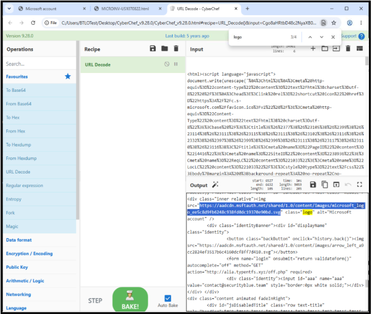
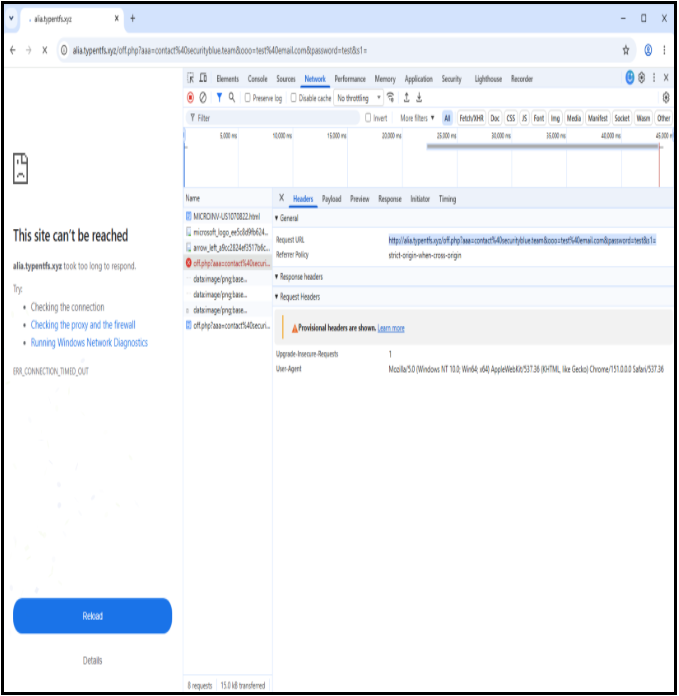

# HTML Credential Harvester Analysis

## Lab Overview

This investigation examined a phishing technique that delivered an HTML credential-harvesting page as an email attachment rather than placing a phishing URL directly in the email body.

The analysis focused on identifying the attachment, collecting file metadata, calculating a cryptographic hash, examining the rendered phishing page, identifying the targeted email address, decoding the HTML source, and observing how submitted credentials were transmitted through the web request.

## Tools Used

- Windows File Properties
- PowerShell
- Google Chrome
- Chrome Developer Tools
- CyberChef

## Investigation Scope

The investigation focused on the following questions:

- What file was attached to the phishing email?
- What is the SHA256 hash of the attachment?
- What is the file size?
- What service or company is the phishing page impersonating?
- What email address was pre-populated in the phishing page?
- What Microsoft logo file was referenced in the decoded source?
- Where were submitted credentials being transmitted?

---

## Investigation Findings

### 1. HTML Attachment Identification

The suspicious attachment was located in the lab environment and its file properties were reviewed to identify the complete filename and file type.

**Observed attachment:** `MICROINV-US1070822.html`

The `.html` extension identifies the attachment as an HTML document capable of rendering web content locally in a browser. In the context of a phishing investigation, HTML attachments require careful examination because they can contain forms, scripts, redirects, or other content designed to imitate legitimate websites and collect user information.

At this stage, the file type alone does not establish malicious intent. The attachment was therefore treated as a suspicious artifact and examined further through hashing, metadata review, source-code analysis, and controlled behavioral observation.

### 2. SHA256 Hash Collection

PowerShell was used to calculate the SHA256 hash of the suspicious `MICROINV-US1070822.html` attachment. The `Get-FileHash` cmdlet was executed against the file, using its default SHA256 hashing algorithm.

**SHA256:**

`0FC57290189ADECFE17F6BACBC515ED080CD63C54B282FDEF4EF3DFC598CDD1E`

The SHA256 hash provides a unique identifier for the attachment and allows the file to be referenced without relying solely on its filename. In a SOC investigation, this value can be used for threat-intelligence searches, reputation checks, file correlation, and comparison against artifacts observed on other systems.

The hash itself does not determine whether the attachment is malicious. It serves as an investigation artifact that can be correlated with additional evidence collected during the analysis.

### 3. Attachment File Size

The file properties of `MICROINV-US1070822.html` were reviewed to collect additional metadata about the suspicious attachment.

**Observed file size:** `14.6 KB`

Recording the file size provides another identifying characteristic of the attachment and can assist with artifact comparison during an investigation.

File size alone does not indicate whether a file is malicious. It should be considered together with the filename, SHA256 hash, file contents, and observed behavior.

### 4. Microsoft Login Page Impersonation

The `MICROINV-US1070822.html` attachment was opened within the controlled lab environment to examine the web page presented to the potential victim.

**Impersonated service:** `Microsoft Outlook / Office 365`

The page was designed to resemble a Microsoft authentication portal and presented the user with a password-entry form. Although the Microsoft logo did not load because the lab environment had no internet connection, the page title and remaining interface elements were consistent with an attempt to imitate a legitimate Microsoft login experience.

This behavior is significant because the HTML attachment is not simply displaying static content. It presents a login interface intended to persuade the recipient to enter account credentials. Further analysis was therefore performed to determine how the page was configured and where submitted information was transmitted.

### 5. Targeted Recipient Identification

The rendered phishing page was examined to determine whether it contained information specific to the intended victim. The login field was already populated with an email address when the HTML attachment was opened.

**Observed targeted email:** `contact@securityblue.team`

The pre-populated email address indicates that the credential-harvesting page was configured to display the target's email address automatically. This can make a phishing page appear more convincing because the victim sees their address already associated with the fake login form.

This artifact also provides useful investigative context by identifying the account targeted by the phishing attempt. In a SOC investigation, the identified account could be used to scope additional searches for related phishing messages and suspicious authentication activity.

### 6. HTML Source Analysis with CyberChef

The source code of the credential-harvesting page was collected and analyzed using CyberChef. The HTML source was pasted into CyberChef and the `URL Decode` operation was applied to make the encoded content easier to inspect.

The decoded source was then searched for references to `logo` to identify the image resource used by the phishing page.

**Observed Microsoft logo filename:**  
`microsoft_logo_ee5c8d9fb6248c938fd0dc19370e90bd.svg`

Identifying the Microsoft-branded resource provides additional evidence that the HTML attachment was designed to imitate a Microsoft authentication page.

This step demonstrates how static source-code analysis can reveal artifacts that may not be immediately visible when viewing the rendered phishing page.

### 7. Credential Submission Network Analysis

I opened **Developer Tools** and selected the **Network** tab to observe the web page's network activity. I then submitted the test password **`test`** and examined the resulting `off.php` request.

The request showed that the phishing page sends the entered credentials to an external domain. Both the email address and submitted test password were included directly in the request URL, demonstrating how the phishing page attempts to capture and transmit a victim's credentials.

**Observed Request URL (defanged):**

`hxxp://alia[.]typentfs[.]xyz/off.php?aaa=contact%40securityblue.team&ooo=test%40email.com&password=test&s1=`

The request contains several important artifacts:

- **Destination domain:** `alia[.]typentfs[.]xyz`
- **Endpoint:** `/off.php`
- **Targeted email:** `contact@securityblue.team`
- **Submitted test password:** `test`

This network behavior provides strong evidence that the HTML attachment functions as a **credential harvester**. Rather than simply displaying a fake Microsoft login page, the form attempts to transmit information entered by the user to external infrastructure.

The URL has been defanged in this documentation to prevent accidental navigation.
