# Phishing Email Investigation — Evidence and Incident Response

This directory contains supporting screenshot evidence from a phishing email investigation lab. The investigation involved reviewing suspicious email messages, analyzing raw email headers, identifying malicious infrastructure, extracting indicators of compromise (IOCs), examining suspicious attachments, and documenting recommended incident-response actions.

The evidence presented here was collected in a controlled lab environment. Production containment, eradication, remediation, and recovery activities described in this project are recommended SOC actions and were not performed against a live enterprise environment.

---

## Investigation Overview

The lab involved reviewing multiple suspicious email messages and determining which messages represented malicious activity.

The investigation focused on:

- Email classification and phishing identification
- Raw email header analysis
- Sender and recipient identification
- Subject and timestamp analysis
- Sending infrastructure identification
- Reverse DNS and WHOIS investigation
- Suspicious URL extraction
- Attachment analysis
- File-extension analysis
- SHA256 identification
- IOC collection
- Incident scoping
- Containment and remediation planning
- Recovery and post-incident monitoring
- Lessons learned and security improvements

Two messages were identified as malicious during the investigation:

- **Email One** — Amazon-themed phishing email containing a suspicious refund-related hyperlink
- **Email Three** — COVID-19-themed phishing email containing a disguised executable attachment

---

# Incident Response and Remediation

The following evidence demonstrates how the confirmed phishing findings were translated into recommended SOC incident-response actions.

These actions represent the response that would be appropriate in a production environment based on the available evidence. They were not executed against live enterprise systems.

---

## Incident Classification

The confirmed phishing activity would be classified as a security incident involving social engineering, credential-theft risk, and potential malware delivery.

The investigation identified malicious email behavior that could result in credential compromise or endpoint execution if a recipient interacted with the malicious content.

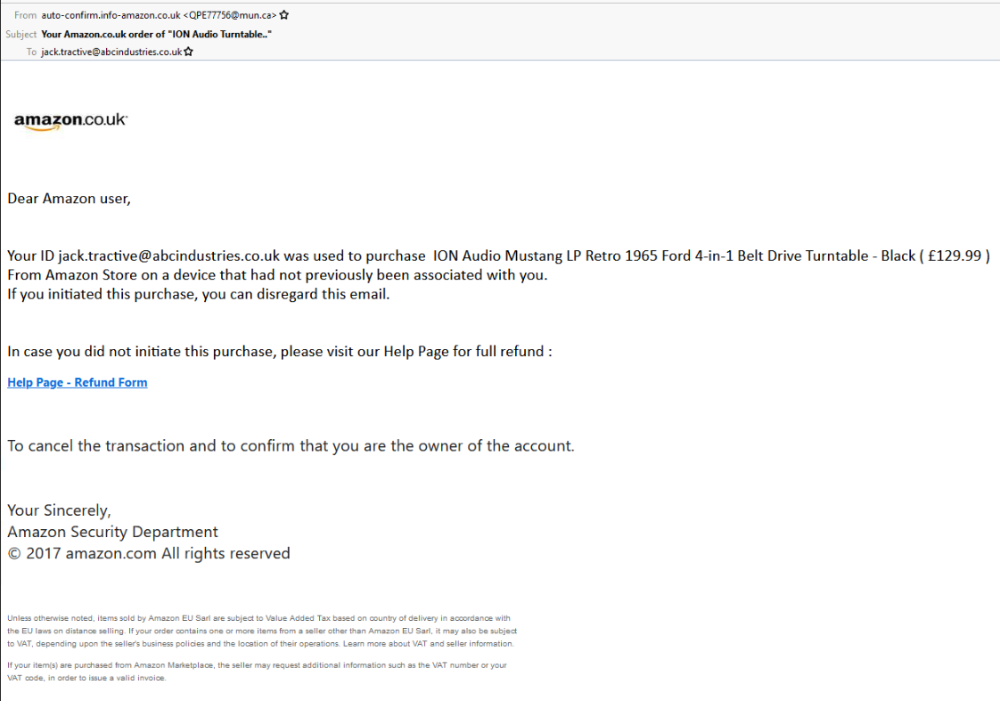

---

## IOC-Based Scoping

Indicators collected during the investigation can be used to search enterprise telemetry for additional affected users, endpoints, or network activity.

Relevant data sources for scoping could include:

- Email gateway logs
- Endpoint detection and response telemetry
- DNS logs
- Proxy and web-filtering logs
- Firewall logs
- Authentication logs
- SIEM data

IOC-based searches help determine whether other users received the same messages or interacted with the identified infrastructure.

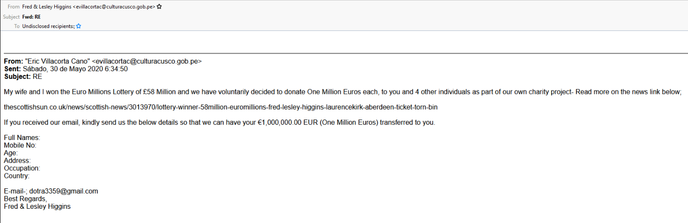

---

## Containment Recommendations

Recommended containment actions include blocking confirmed malicious indicators where appropriate, quarantining matching phishing messages, identifying potentially affected users, and isolating endpoints if evidence indicates malicious execution.

Containment decisions should be based on validated evidence and organizational response procedures.

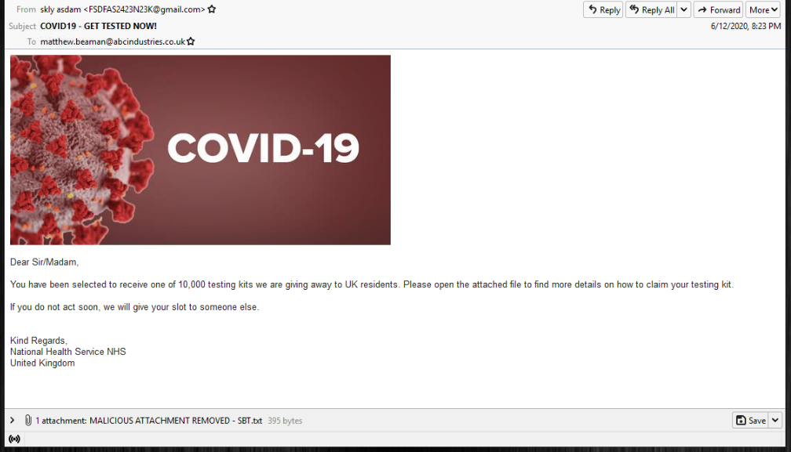

---

## Eradication and Remediation

If compromise were confirmed, remediation could include removing malicious files, eliminating persistence mechanisms, resetting exposed credentials, revoking active sessions, and validating affected systems before returning them to normal operation.

Any remediation performed in a production environment should follow established incident-response procedures and preserve relevant evidence.

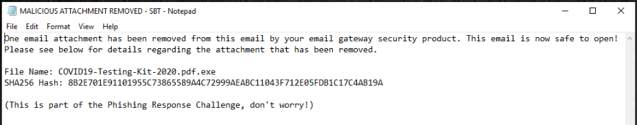

---

## Recovery and Post-Incident Monitoring

Following containment and remediation, affected systems and accounts should be monitored for signs of recurring or related malicious activity.

Post-incident monitoring could include authentication activity, endpoint telemetry, network connections, email activity, and additional IOC matches.

---

## Lessons Learned and Security Improvements

The incident should be reviewed to identify opportunities to improve preventive and detective controls.

Potential improvements include strengthening email filtering, increasing phishing-awareness training, improving endpoint visibility, reviewing attachment controls, refining detection logic, and incorporating confirmed indicators into appropriate security monitoring systems.

---

# Email One — Amazon-Themed Phishing Investigation

Email One impersonated Amazon and attempted to convince the recipient to interact with a refund-related hyperlink.

The investigation included analysis of the sender information, email headers, sending infrastructure, and suspicious URL.

---

## Sending Address

**Finding:** `QPE77756@mun.ca`

The raw email was reviewed in a text editor and the `From:` field was located. The actual sender address appeared inside the angle brackets, while the preceding text represented the display name.

Display names can be controlled by the sender and therefore should not be relied upon by themselves when determining the true sending address.

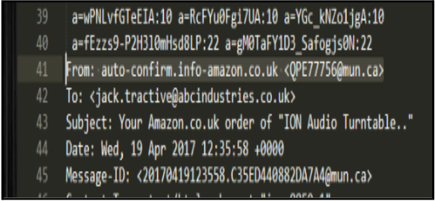

---

## Subject Line

**Finding:** `Your Amazon.co.uk order of "ION Audio Turntable.."`

The `Subject:` field was identified within the raw email headers to determine the subject line associated with the message.

The Amazon-themed subject contributed to the social-engineering context of the email.

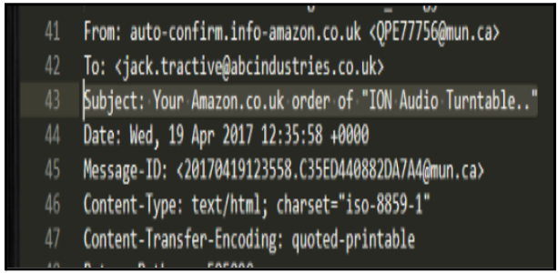

---

## Email Date and Time

**Finding:** `Wed, 19 Apr 2017 12:35:58 +0000`

The `Date:` field within the raw email headers was reviewed to identify the timestamp recorded for the message.

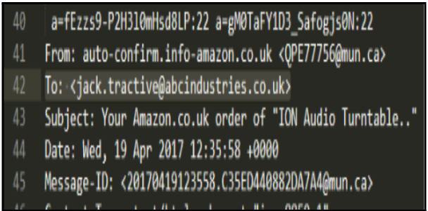

---

## Additional Timestamp Verification

The raw email headers were also examined directly in the text editor to verify the timestamp associated with the message.

Header-level verification is useful because it allows the analyst to work directly with the underlying message metadata rather than relying only on information rendered by the email client.

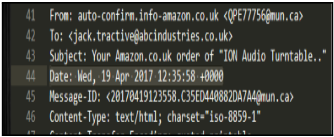

---

## Sending Server IP

**Finding:** `68.114.190.29`

The raw email headers contained multiple references to the sending IP address. Authentication-related header information also referenced the same IP, providing additional evidence regarding the infrastructure involved in sending the message.

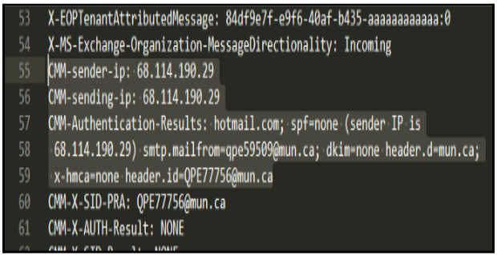

### Authentication Evidence

Authentication-related header information was reviewed as additional supporting evidence for the identified sending infrastructure.

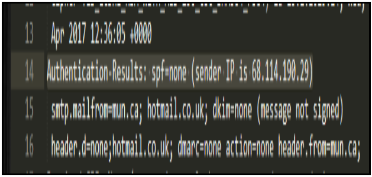

---

## Reverse DNS Hostname

**Sending IP:** `68.114.190.29`

The sending IP was investigated using available WHOIS information and the historical routing information preserved within the original email headers.

Current IP ownership or DNS information may differ from information that existed when an older email was originally transmitted. For that reason, the original email headers were also reviewed when investigating the sending infrastructure.

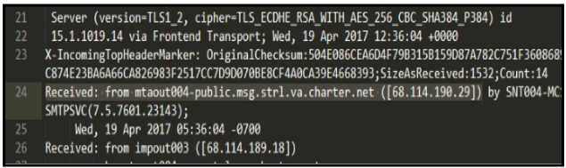

---

## Suspicious URL Extraction

The suspicious hyperlink was extracted from the email without intentionally browsing directly to the destination.

The link was copied from the email client so that the underlying destination could be examined separately.

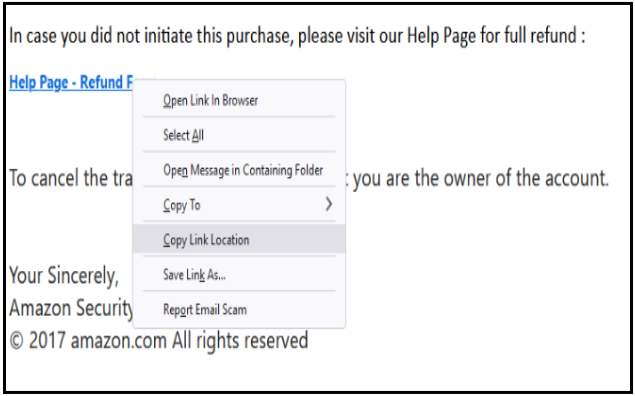

---

## Full Suspicious URL

The extracted URL was reviewed as an investigation artifact.

The URL structure and the surrounding Amazon-themed social engineering increased suspicion that the destination could have been associated with credential harvesting.

At this stage, credential harvesting was treated as an investigative hypothesis based on the available evidence rather than as a confirmed result of destination-page analysis.

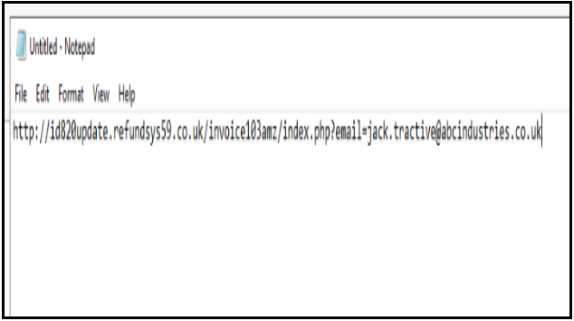

---

## Email One Assessment

**Verdict:** Malicious — Phishing

Email One demonstrated several suspicious characteristics, including Amazon impersonation, questionable sender information, social-engineering language, and a suspicious refund-related hyperlink.

The combination of these indicators supported classification of the message as phishing.

---

# Email Three — COVID-19 Attachment Phishing Investigation

The second malicious message identified during the lab used a COVID-19 testing theme and attempted to convince the recipient to interact with an attachment.

Analysis of the attachment information ultimately revealed that the original file used a double extension ending in `.exe`.

---

## Sending Address

**Finding:** `FSDFA52423N23K@gmail.com`

The raw email was opened in a text editor and the `From:` field was located to identify the sender's email address.

The use of a Gmail account was notable in the context of the message's claimed identity and social-engineering theme.

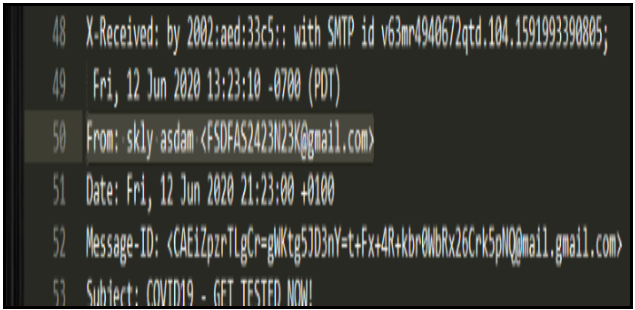

---

## Subject Line

**Finding:** `COVID19 - GET TESTED NOW!`

The `Subject:` field was located within the raw email headers.

The wording used urgency and a COVID-19 testing theme to encourage recipient interaction.

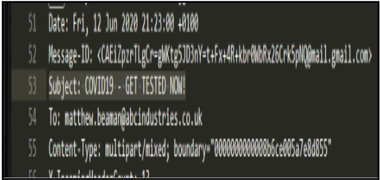

---

## Email Date and Time

**Finding:** `Fri, 12 Jun 2020 21:23:00 +0100`

The `Date:` field within the raw email headers was reviewed to determine the timestamp recorded for the message.

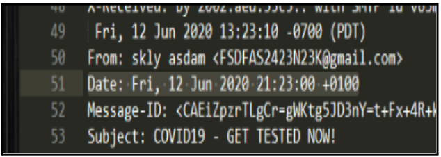

---

## Sending Server IP

**Finding:** `209.85.160.173`

The raw email headers were examined to identify the sending server IP associated with the message.

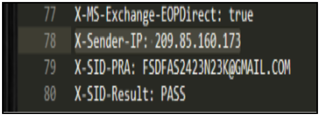

---

## Reverse DNS Hostname

**Finding:** `mail-qt1-f173.google.com`

**Sending IP:** `209.85.160.173`

The sending IP was investigated using WHOIS/reverse-DNS information. The resolved hostname was associated with Google mail infrastructure, which was consistent with the Gmail sender observed in the message.

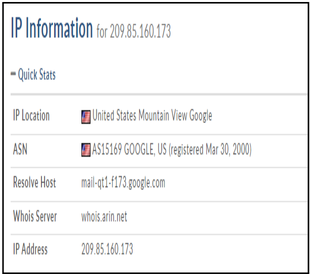

---

## Removed Attachment Evidence

The original potentially malicious attachment had already been removed by the simulated email security gateway.

A replacement text attachment was inserted to indicate that the original file had been removed. Examination of the raw email content confirmed the presence of this replacement attachment.

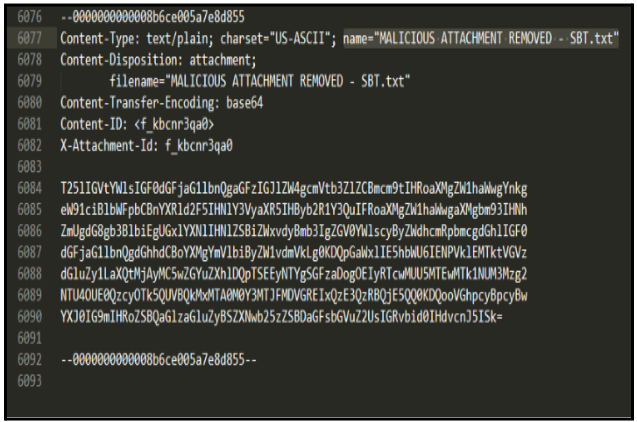

---

## Original Attachment Filename

**Finding:** `COVID19-Testing-Kit-2020.pdf.exe`

The replacement text file was examined to determine the name of the original attachment that had been removed by the email security gateway.

The recovered filename used a double extension:

`COVID19-Testing-Kit-2020.pdf.exe`

Although the filename contains `.pdf`, its final extension is `.exe`, meaning the file is an executable rather than a PDF document.

This naming technique can make a malicious executable appear more trustworthy to a recipient who does not notice the final file extension.

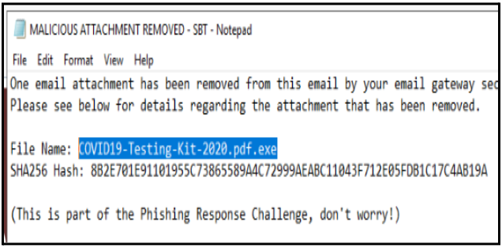

---

## SHA256 Indicator

The replacement notification supplied by the lab also contained the SHA256 value associated with the removed attachment:

`8B2E701E91101955C73865589A4C72999AEABC11043F712E05FDB1C17C4AB19A`

Because the original executable had already been removed, the file was not executed or independently hashed during this investigation.

The supplied SHA256 value can nevertheless be documented as an IOC and used for additional investigation or telemetry searches.

---

## Email Three Assessment

**Verdict:** Malicious — Phishing / Suspected Malware Delivery

Email Three combined social engineering with a suspicious executable attachment.

The COVID-19 testing theme created urgency, while the original attachment filename used a `.pdf.exe` double extension that could mislead a recipient into believing the file was a document rather than an executable.

The attachment had already been removed by the simulated email security gateway, reducing the need to interact directly with the potentially dangerous file.

---

# Indicators of Compromise

The investigation identified several artifacts that could support additional SOC investigation and scoping.

## Email One

**Sender Email:** `QPE77756@mun.ca`

**Sending IP:** `68.114.190.29`

**Artifact:** Suspicious Amazon-themed refund URL

## Email Three

**Sender Email:** `FSDFA52423N23K@gmail.com`

**Sending IP:** `209.85.160.173`

**Reverse DNS:** `mail-qt1-f173.google.com`

**Attachment:** `COVID19-Testing-Kit-2020.pdf.exe`

**SHA256:** `8B2E701E91101955C73865589A4C72999AEABC11043F712E05FDB1C17C4AB19A`

IOC classification and blocking decisions should consider the context of the investigation. Infrastructure associated with legitimate shared services should not automatically be blocked solely because it appeared in a malicious message.

---

# Investigation Conclusion

The phishing investigation demonstrated a structured approach to analyzing suspicious email activity and documenting evidence.

Two malicious messages were identified.

Email One used an Amazon-themed social-engineering lure and directed the recipient toward a suspicious refund-related URL. Analysis included sender identification, header inspection, sending infrastructure investigation, reverse-DNS analysis, and URL extraction.

Email Three used a COVID-19 testing theme and attempted to deliver an executable attachment. Although the simulated email gateway had removed the original attachment, examination of the replacement notification revealed the original filename and associated SHA256 value.

The investigation produced actionable artifacts that could be used for IOC-based scoping across email, endpoint, authentication, DNS, proxy, firewall, and SIEM telemetry.

The project demonstrates practical SOC analyst skills including:

- Phishing email triage
- Raw email header analysis
- Sender and infrastructure investigation
- Email authentication review
- URL extraction
- Reverse DNS and WHOIS analysis
- Attachment investigation
- File-extension analysis
- SHA256 IOC identification
- Evidence documentation
- Incident classification
- IOC-based scoping
- Containment planning
- Remediation planning
- Recovery and post-incident monitoring

The findings and supporting screenshots provide an evidence-based record of the investigation while maintaining a clear distinction between actions performed during the lab and response actions that would be recommended in a production SOC environment.
